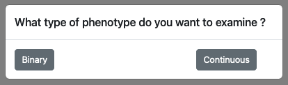
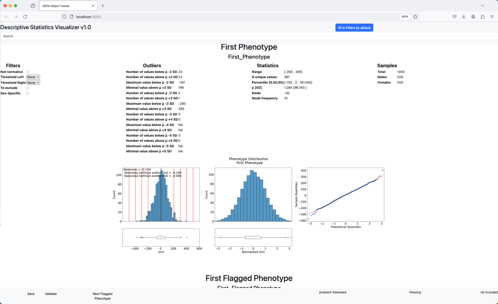
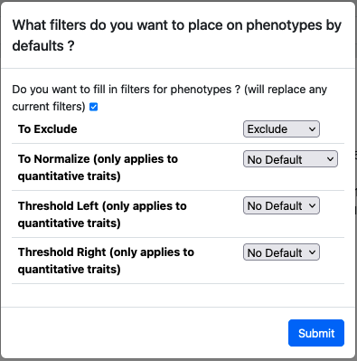

# Filtering Tool Documentation

This tools' aim is to aid in the visualisation of phenotype and record proposed futur filtering of the dataset, in a easy to use way. This repository doesn't and will not contain any data related to any real phenotypes, however the tool if placed in a directory along appropriate files can be used to visualised these files.

## Normal Usage 
We aim for to be a companion to a phenotypic summary statistic pipeline. it's functionning is as follow :

1) Download the system appropriate executable (windows or mac) and place it within the same directory as the output of the phenotypic summary statistic pipeline (more detail can be obtained below).
2) After opening the executable, you will be prompted which type of variable is desired :

   This relies on the presence of a file named continuous_data.json or binary_data.json (depending on the selected option)
3) Phenotypes will be displayed.

4) (Optional) To establish a default proposed filtering click the 'fill in Filters by default'

6) (Optional) 'Validate' button will interrogate all flagged phenotype for either Exclusion or Sex-Specific filters.
7) 'Save' will record the filters within the read file.
